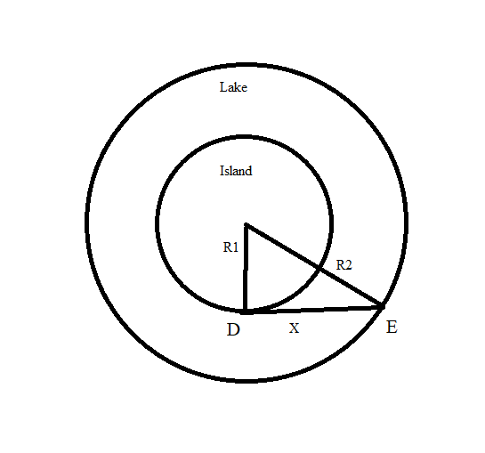

# Problem Description

### Problem: [Life of Phi](https://toph.co/p/life-of-phi)
### Contest: [Practice Contest for the 2019 ICPC Asia Regional Dhaka Site Preliminary | Toph](https://toph.co/c/practice-icpc-2019-dhaka)
### Statement
Dr Tanzil has a circular shaped lake that he bought long ago. One day while he was visiting there, he found out with great surprise that, there has risen a round shaped island exactly from the center of the lake. He was very happy and considered the island as a gift from God. He decided to use the island for the welfare of people. So he decided to build a library that would be open for everyone.

As Dr Tanzil is very busy, he hired a developing company to build the library. To do that, first of all the developing company has to know the area of the island. But Dr Tanzil asked them not to measure the area of the island. Instead he asked the company to calculate the area of the remaining lake, from which the area of the island can later be calculated.

The only data available to complete this calculation is the length of slope that touches the side of the island at a point D and touches the lake side at another point E. As the company has no geometry expert, they need your help to find out the area of the lake.

### Input
First line of the input contains an integer T(1 < T < 1000) which denotes the number of test cases. Then for each test case, there will be an integer L(1 < L < 1000) which denotes the length of the tangent.

### Output
For each input, output the area of the lake. You need to be precise up to 4 decimal places.

# Solution
Read this line very carefully

*The only data available to complete this calculation is the length of slope that touches
the side of the island at a point D and touches the lake side at another point E.*

```
Let's denote,
Radius of Lake = R2
Radius of island = R1
The distance between D and E = x
```
See the following figure for clarification

```
So, we may say that:
The area of the island = pi * R2 * R2 - pi * R1 * R1
                       = pi * (R2 * R2 - R1 * R1)
                       = pi * x * x [because, DE is a tangent to Island, which is a circle]
```